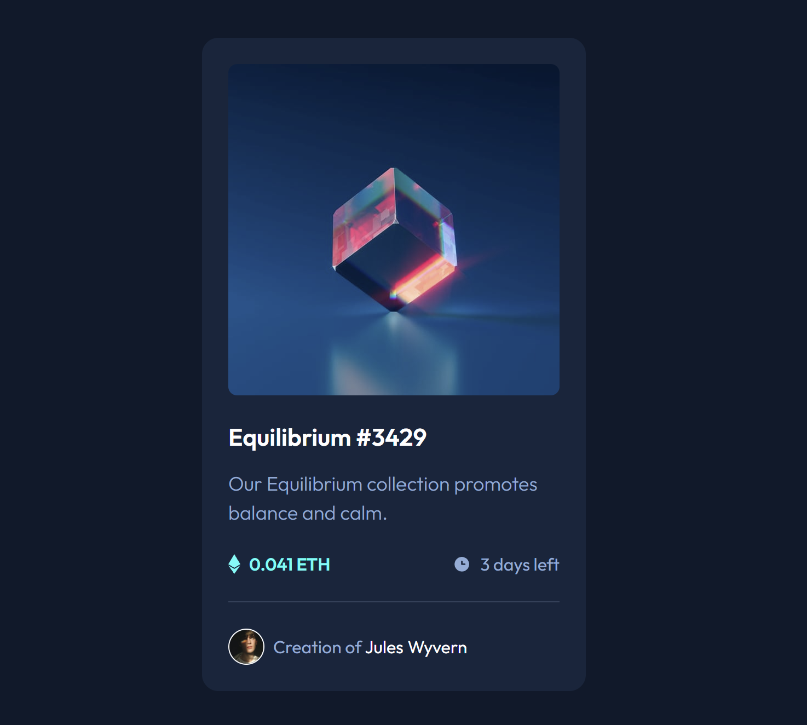

# Frontend Mentor - NFT preview card component solution

This is a solution to the [NFT preview card component challenge on Frontend Mentor](https://www.frontendmentor.io/challenges/nft-preview-card-component-SbdUL_w0U). Frontend Mentor challenges help you improve your coding skills by building realistic projects.

## Table of contents

- [Overview](#overview)
  - [The challenge](#the-challenge)
  - [Screenshot](#screenshot)
  - [Links](#links)
- [My process](#my-process)
  - [Built with](#built-with)
  - [What I learned](#what-i-learned)
  - [Useful resources](#useful-resources)
- [Author](#author)

## Overview

### The challenge

Users should be able to:

- View the optimal layout depending on their device's screen size
- See hover states for interactive elements

### Screenshot



### Links

- Solution URL: [Github](https://github.com/KrisvHeij/NFT-preview-card-component)
- Live Site URL: [Github Pages](https://krisvheij.github.io/NFT-preview-card-component/)

## My process

### Built with

- Semantic HTML5 markup
- CSS custom properties
- Flexbox
- Mobile-first workflow

### What I learned

The part that took me the most time was the hover effect on the NFT image hover state. This is the solution I came up with:

```html
<div class="overlay">
  <div class="overlay--hover"></div>
  
</div>
```

```css
.overlay {
  margin-block-end: var(--spacing-300);
  position: relative;
  cursor: pointer;
}

.overlay--hover {
  width: 100%;
  height: 100%;
  position: absolute;
  background-color: var(--c-cyan-400);
  opacity: 0;
  border-radius: 0.5rem;
  transition: opacity 250ms ease;
  z-index: 1;
}

.overlay::before {
  content: url(/images/icon-view.svg);
  display: flex;
  justify-content: center;
  align-items: center;
  position: absolute;
  opacity: 0;
  width: 100%;
  height: 100%;
  z-index: 2;
  pointer-events: none;
  transition: opacity 250ms ease;
}

.overlay:hover .overlay--hover {
  opacity: 0.5;
}

.overlay:hover::before {
  opacity: 1;
}
```

### Useful resources

- [MDN Docs](https://developer.mozilla.org/en-US/)

## Author

- Frontend Mentor - [@KrisvHeij](https://www.frontendmentor.io/profile/KrisvHeij)
